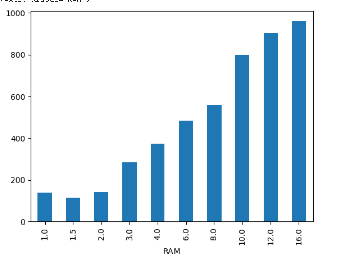
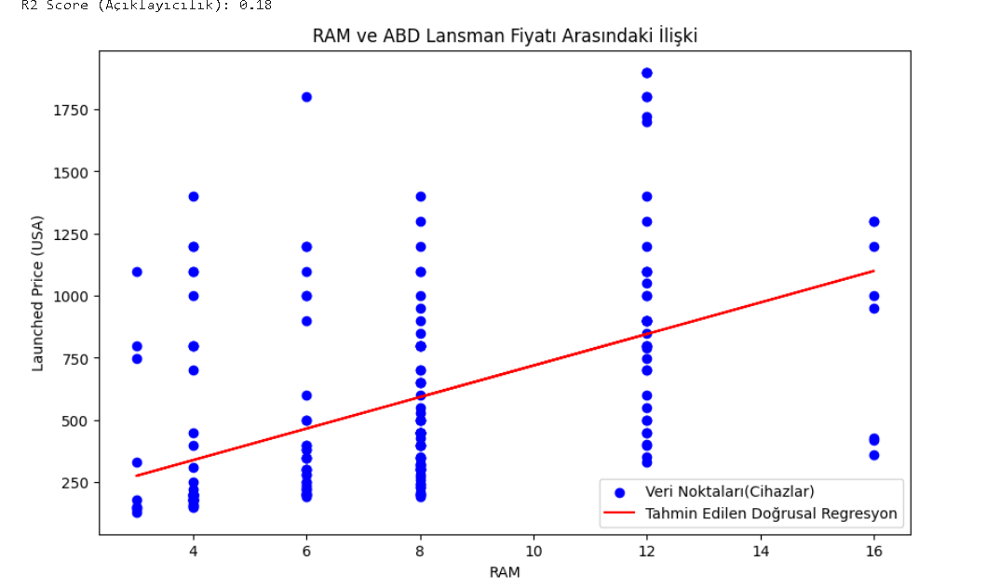
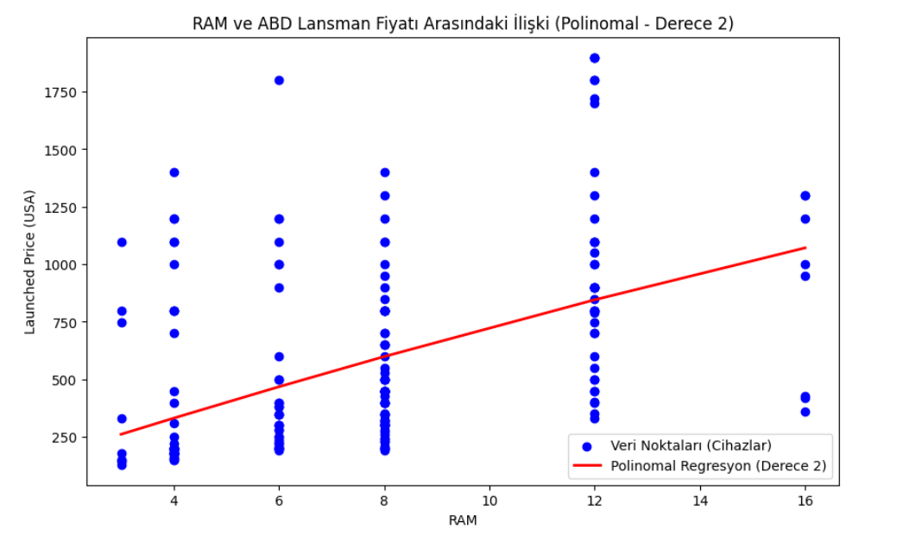
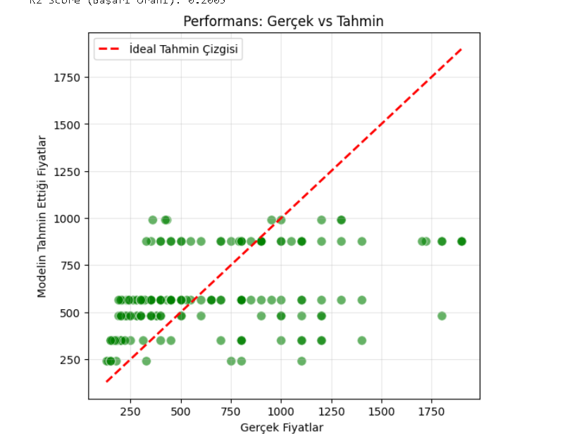
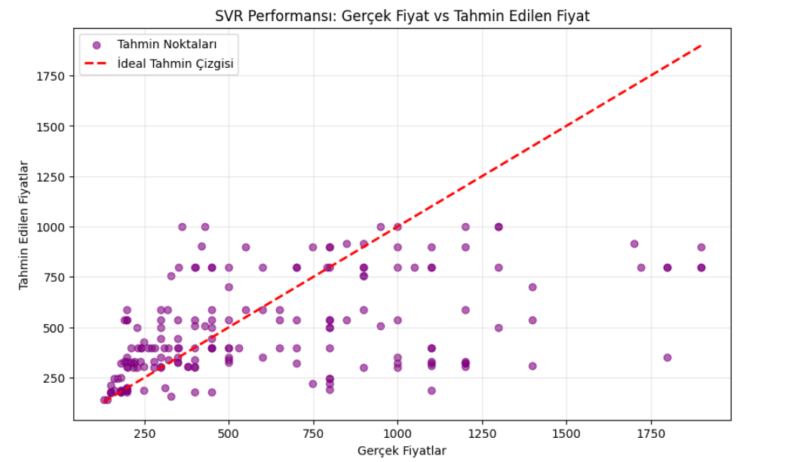
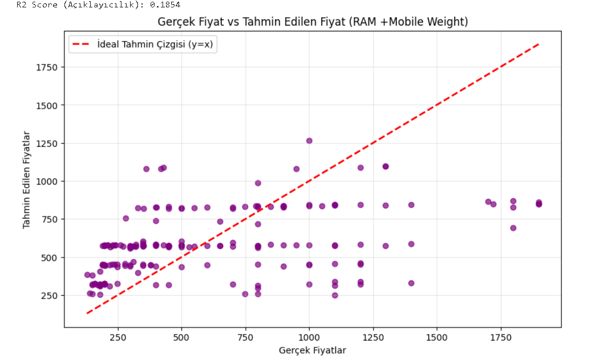

# Mobile Device Price Prediction
## Projenin Amacı

Bu projenin temel amacı, mobil cihaz fiyatlarını (Launched Price (USA)) etkileyen özellikleri sırayla deneyerek en uygun özelliği seçip fiyatla arasındaki ilişkiyi incelemek ve en uygun regresyon modelini uygulayarak fiyat tahmini yapmaktır.

## Kullanılan Veri Seti

Telefonlara ait:

Marka

Model

RAM

Ağırlık

Kamera çözünürlükleri

Ekran boyutu

Batarya kapasitesi

Farklı ülkelere göre fiyatlar

Çıkış yılı

gibi özellikleri içermektedir.

Projenin adımları şu şekildedir:

### 1)Veri setinin yüklenmesi:

        import pandas as pd
        import matplotlib.pyplot as plt
        import numpy as np

        mobiles=pd.read_csv("mobiles_dataset.csv",encoding='latin-1')
        mobiles.head()

Veri temizliği için pandas,regresyon sonuçlarını ve korelasyon matrisini gösterebilmek için  matplotlib,gerekli hesaplamalar için numpy kütüphanesi kullanılmıştır.

### 2)Fiyat Temizleme

    x = re.sub(r"[A-Za-z\s]+", "", x)
    x = x.replace(",", "")
    
USD,PKR gibi para birimi sembollerini,harfleri,virgülleri kaldırır.Sayısal olmayan bütün ifadeler kaldırılır.

    price_columns = [col for col in mobiles.columns if "Price" in col]

Price içeren bütün sütunları tespit eder ve bir liste oluşturur.

    for col in price_columns: mobiles[col] = mobiles[col].apply(clean_price_fixed_FINAL)

Bir döngü (loop) ile tespit edilen her bir fiyat sütununa sırayla girilir.

apply(clean_price_fixed_FINAL) komutu, o sütundaki her değere temizleme fonksiyonunu uygulayarak orijinal metin verilerini temizlenmiş sayısal (float) verilerle değiştirir.

    threshold=5000
    mobiles = mobiles[mobiles['Launched Price (USA)'] < threshold].copy()

Ayrık değerler tespit edilir.5000 in üstündeki değerler çıkarılır.

### 3)Bağımsız Özellikleri Temizleme

RAM,Mobile Weight,Battery Capacity,Front Camera,Back Camera,Screen Size özelliklerindeki sayısal olmayan ifadeler kaldırılmıştır.

### 4)Hedef Belirleme 

Bağımlı değişken (y) ,daha evrensel bir para birimi olduğu için  Launched Year(USA) olarak belirlenmiştir.

Bağımsız değişken(x) ise diğer özelliklerin hepsi karşılaştırılarak en uygun özellik RAM olarak belirlenmiştir.

### 5) Korelasyon Matrisi
   
Korelasyon matrisi,iki veya daha fazla değişkenin ne kadar güçlü ve ne yönde ilişkili olduğunu gösteren istatistiksel bir araçtır.’ değişkenin arasındaki katsayı 1,e ne kadar yakınsa bu onların arasında güçlü ilişki olduğunu gösterir. 

Isı haritasında da görüldüğü gibi en uygun ilişki Launched Price(USA) ile  RAM dir.

### 6)RAM miktarı ile telefonların ortalama lansman fiyatı arasındaki ilişkiyi gösteren bar grafiği

Aşağıdaki bar grafiğinde de görüldüğü gibi RAM miktarı arttıkça Launched Price(USA) de artmaktadır.

### 7)Regresyon Uygulama

### Linear Regresyon

#### Hazırlık ve Veri Bölme

    ram_price_df = mobiles[[feature, target]].copy()

Sadece RAM ve Launched Price (USA) sütunlarını içerir.

    clean_subset = ram_price_df.dropna()

Seçilen bu iki sütundan herhangi birinde eksik (NaN) değere sahip olan tüm satırları veri setinden çıkarır.

    X = clean_subset[feature].to_numpy().reshape(-1, 1)

RAM sütununu alır ve scikit-learn kütüphanesinin ihtiyacı olan 2 boyutlu matris (reshape(-1, 1)) formatına dönüştürür.

    X_train, X_test, y_train, y_test = train_test_split(
        X, y,
        test_size=0.2,
        random_state=42
)

Veri setini rastgele olarak %80 Eğitim (_train) ve %20 Test (_test) kümelerine ayırır. random_state=42 ise bu rastgeleliği sabitler.

#### Model Kurulumu ve Eğitim

    lin_reg.fit(X_train, y_train)

Model, eğitim özelliklerini (X_train) ve bunlara karşılık gelen gerçek fiyatları (y_train) kullanarak en uygun düz çizgiyi (regresyon doğrusu) bulur.
    y_pred = lin_reg.predict(X_test)

Eğitilen modeli kullanarak, daha önce görmediği test verilerindeki (X_test) RAM değerleri için fiyat tahmini (y_pred) yapar.

    rmse = np.sqrt(mean_squared_error(y_test, y_pred))
    r2_score_test = lin_reg.score(X_test, y_test)

Ortalama karekök hata hesaplanır.Modelin tahminlerinin gerçek değerden ne kadar saptığını hesaplar.

Belirleme katsayısı hesaplanır.Modelin fiyattaki değişim yüzdesini açıklar.

#### Görselleştirme

Grafik boyutu,gerçek veri noktaları ve regresyon doğrusu oluşturulur.

    plt.figure(figsize=(10, 6))
    plt.scatter(X_test, y_test, color='blue', label='Veri Noktaları(Cihazlar)')
    plt.plot(X_test, y_pred, color='red', label='Tahmin Edilen Doğrusal Regresyon')
    plt.title('RAM ve ABD Lansman Fiyatı Arasındaki İlişki')
    plt.xlabel('RAM')
    plt.ylabel('Launched Price (USA)')
    plt.legend()
    plt.show()

### Polinomal Regresyon

RAM özelliğini alır ve degree=2 (ikinci derece/karesel) kullanarak onu yeni bir özellik setine dönüştürür. Basitçe, orijinal $x$ (RAM) değerini x^2 formunda genişletir.

Bu yeni, genişletilmiş özellikler seti üzerine klasik bir Doğrusal Regresyon (LinearRegression) modeli eğitilir. Bu, modelin aslında bir eğri öğrenmesini sağlar.

Grafikte de görüldüğü gibi polinomal regresyon doğru bir yaklaşım değildir.Basitlik ve yorumlanabilirlik için fazla karmaşıktır.

### Random Forest

Karar ağaçlarından oluşur.Ağaçların ortalamasını alır.

Tahminleri yorumlamak zordur.

Grafikte görüldüğü gibi linear regresyonla arasında çokn büyük bir fark yoktur ve bu durumda uygun olan daha basit yorumlaması kolay olan linear regresyonu kulllanmaktır.

### Lojistik Regresyon 

Lojistik regresyon uygulamak için kategorik ifadeler olması gerekir.Lojistik regresyonun çıktısı 0-1 arasındadır.Fiyat tahmini için uygun değildir.

### SVR

Amacı, veri noktalarının çoğunu epsilon adı verilen belirli bir hata marjı içinde tutan en iyi sınırı bulmaktır . Hata marjı içindeki noktalar umursanmaz, sadece bu marjın dışındaki noktalar (Destek Vektörleri) hataya neden olur.

Grafikte görüldüğü gibi düşük açıklama gücü ve yüksek hata payından dolayı uygun değildir.

### Çoklu Linear Regresyon 

RAM ve Launched Year’ın birlikte kullanılması da basit regresyondan farklı bir sonuca ulaşmamıştır.

## Sonuç

Veri setindeki özellikler içinn gerekli temizlik yapılarak  sayısal değerler dışındaki ifadeler çıkarılmıştır.

Fiyat tahmini yapmak için en uygun özellik olarak RAM  belirlenmiştir.Isı haritası bunu doğrular.

Regresyon modelleri uygulanmıştır ve en uygun olarak linear regresyon seçilmiştir.

Uygulanan regresyon modellerindeki ortalama hata ve açıklayıcılık oranları genel olarak birbirine yakındır.Bu durumdan dolayı basit ve anlaşılır olması için linear regresyonun seçilmesi en uygunudur.

